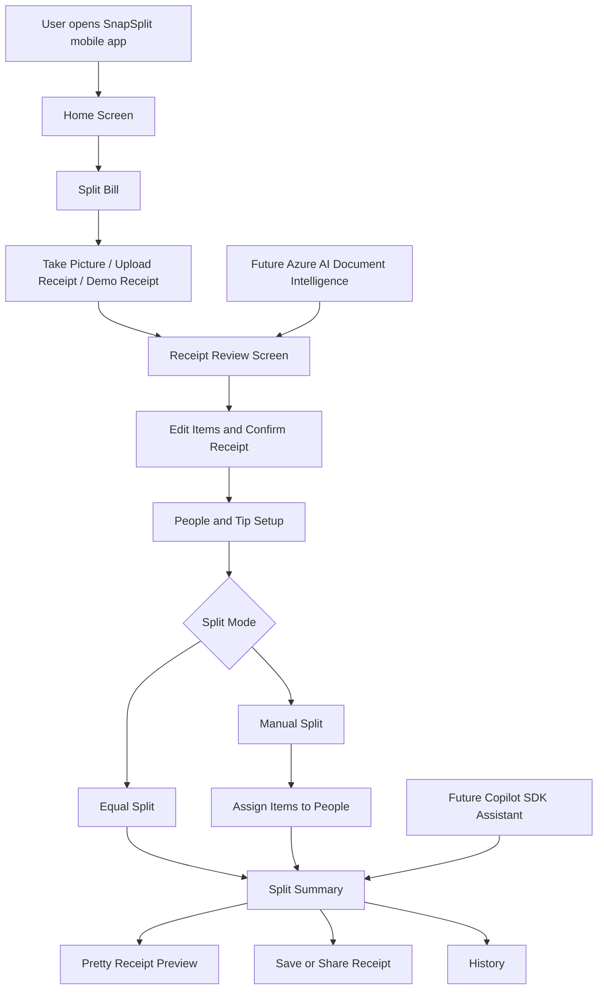

# SnapSplit AI

SnapSplit AI is a mobile receipt-splitting app for group dinners. It helps users split restaurant bills fairly by uploading or taking a receipt photo, reviewing detected items, adding friends, assigning items to people, splitting shared items, adding tips, and generating a clear split summary that can be saved or shared.

## Problem

Splitting a restaurant bill with friends can be frustrating. People order different items, some dishes are shared, tips need to be added, and it is easy to forget who had what. In many group dinners, someone has to manually calculate everything, which can lead to confusion or unfair payments.

SnapSplit AI solves this by turning the receipt-splitting process into a simple mobile flow.

## Solution

SnapSplit AI lets users:

1. Start a new bill split.
2. Upload or take a receipt photo.
3. Review and edit detected receipt items.
4. Add people and optional contact details.
5. Choose a tip amount.
6. Split the bill equally or manually.
7. Assign receipt items to one or more people.
8. Generate a final split summary.
9. Save the split to history.
10. Share or save a nicely formatted receipt summary.

The app currently includes a reliable demo receipt mode. Real AI receipt reading with Azure AI Document Intelligence is planned as the next integration step.

## Features

### Current MVP Features

* Mobile app built with Expo React Native.
* Clean SnapSplit design with a single blue brand color.
* Bottom navigation with Home, History, Upload, Activity, and Profile.
* Home screen with recent bills and bill history.
* “Split Bill” flow.
* Receipt upload/demo receipt mode.
* Editable receipt review screen.
* Add, edit, and delete receipt items.
* Add people manually.
* Optional phone number or Instagram handle for each person.
* Add tip amount, including a 10% tip option.
* Manual split mode.
* Equal split mode.
* Assign items to one or more people.
* Each person has a distinct color.
* Receipt items show transparent color markers based on assignment.
* Full split summary by person.
* Full original receipt view in bill details.
* Pretty receipt preview.
* Save/share receipt image.
* History detail screen for previous bills.
* Local app flow designed for hackathon demo reliability.

### Planned AI Features

* Azure AI Document Intelligence receipt parsing.
* Automatic item and price extraction from receipt photos.
* AI confidence indicators for detected items.
* Copilot SDK assistant to explain the split.
* AI-generated payment message.
* AI suggestions for shared items.
* Optional kcal estimation per item.

## Tech Stack

* **Mobile:** Expo React Native
* **Language:** TypeScript
* **UI:** React Native components
* **Local data:** App state / planned AsyncStorage
* **Receipt image export:** View capture and Expo sharing/media tools
* **AI planned:** Azure AI Document Intelligence
* **Development:** VS Code + GitHub Copilot

## GitHub Copilot Usage

GitHub Copilot was used during development to speed up the creation of the mobile app.

Copilot helped with:

* generating React Native screen structure;
* improving TypeScript interfaces;
* building the bill split flow;
* creating the receipt review screen;
* improving the item assignment logic;
* creating the split summary screen;
* adding share/save receipt functionality;
* debugging Expo and package issues;
* improving UI spacing and mobile usability;
* preparing documentation for the project.

All generated code was reviewed and adjusted manually.

## Current Demo Mode

The app currently uses demo receipt data to keep the hackathon demo stable and reliable.

Current demo flow:

1. Open SnapSplit.
2. Tap **Split Bill**.
3. Choose **Use Demo Receipt**.
4. Review detected receipt items.
5. Edit, add, or delete receipt items.
6. Tap **Looks good**.
7. Add people.
8. Choose tip.
9. Choose manual or equal split.
10. Assign items.
11. View summary.
12. Save/share receipt.
13. Open the saved bill from History.

Real receipt OCR will be connected later through Azure AI Document Intelligence.

## How to Run

### Requirements

* Node.js
* npm
* Expo Go app on iPhone or Android
* VS Code recommended

This project is configured for **Expo SDK 54**.

### Install dependencies

From the mobile folder:

```bash
cd mobile
npm install
```

### Start the app

```bash
npx expo start --clear
```

On Windows PowerShell, use:

```powershell
npx.cmd expo start --clear
```

Then scan the QR code with Expo Go.

## Important Version Note

The project should stay compatible with:

```text
Expo SDK 54
React Native 0.81.4
```

Do not upgrade Expo or React Native unless Expo Go on the test device is also updated and compatible.

## Project Structure

```text
mobile/
├── App.tsx
├── app.json
├── package.json
├── tsconfig.json
├── src/
│   ├── components/
│   ├── data/
│   ├── logic/
│   ├── screens/
│   ├── theme.ts
│   └── types.ts
```

## Architecture



## Future Azure AI Integration

The planned AI flow is:

```text
Receipt photo
↓
Backend API
↓
Azure AI Document Intelligence
↓
Extracted receipt items and prices
↓
Editable receipt review screen
↓
SnapSplit split engine
```

This design keeps the app reliable because users can manually correct AI-extracted receipt items before splitting the bill.

## Safety and Privacy

This repository does not include:

* real receipts;
* personal data;
* API keys;
* customer data;
* payment credentials;
* production secrets.

Any future API keys should be stored in environment variables and excluded from GitHub using `.gitignore`.

## Hackathon Submission Summary

SnapSplit AI is a creative mobile app that makes group bill splitting easier, clearer, and more fun. It transforms a common real-life problem into a clean interactive mobile experience where users can review a receipt, assign items, split shared dishes, add tips, and generate a clear receipt summary for each person.

The project demonstrates AI-assisted development with GitHub Copilot and is designed to be extended with Azure AI receipt recognition and Copilot-powered split explanations.
